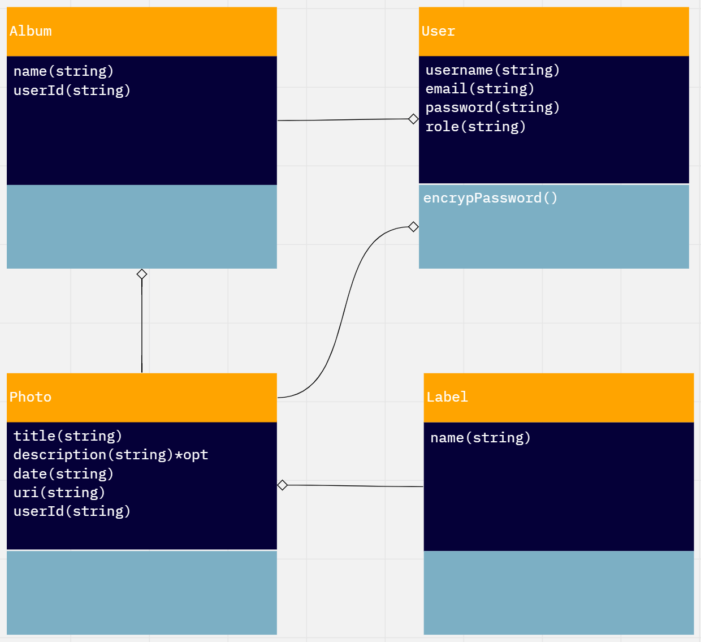
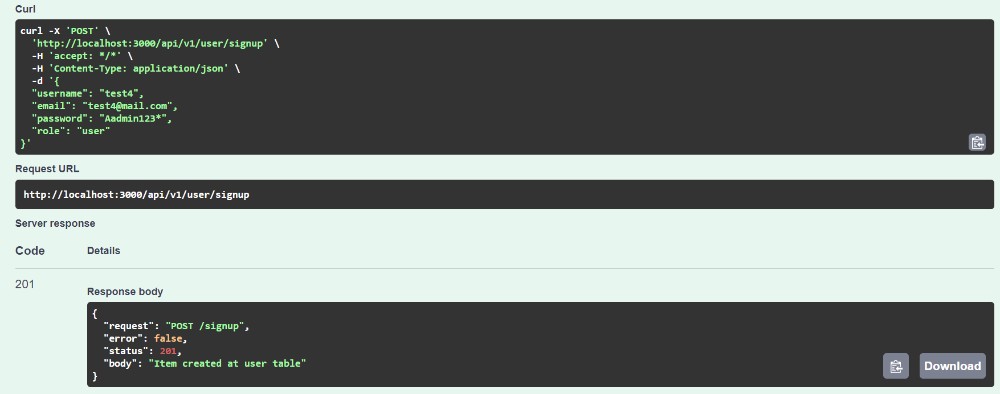

# Unsplash API

## Diagrama de Clases



## Historias de Usuario

### 1. Registro con un correo electronico

#### Codigo

```
{
  "username": "test4",
  "email": "test4@mail.com",
  "password": "Aadmin123*",
  "role": "user"
}
```

#### Salida



### 2. Ingresar a la platforma con correo y contraseña

#### Codigo

```
{
  "email": "test4",
  "password": "test4@mail.com"
}
```

#### Salida


Puedo agregar una nueva foto a mi coleccion de imagenes.

#### Codigo

```
```

#### Salida


Puedo ver una lista de mis fotografias.

#### Codigo

```
```

#### Salida


Puedo ver una lista de fotografias recientes (ultimos 5)

#### Codigo

```
```

#### Salida


Historia de usuario: Puedo buscar fotos por etiqueta.

#### Codigo

```
```

#### Salida


Puedo actualizar una fotografia.

#### Codigo

```
```

#### Salida


Puedo eliminar una fotografia.

#### Codigo

```
```

#### Salida


Todas mis operaciones debe estar protegidas(utilizar jwt).

#### Codigo

```
```

#### Salida


Mi contrasena es segura(Tiene mayuscula, numero, longitu mayor a 8 caracteres, y un caracter especial)

#### Codigo

```
```

#### Salida


## Historias Extras

Cuando elimino una imagen, puedo introducir mi contraseña.

#### Codigo

```
```

#### Salida


Puedo crear un album para mis fotografias.

#### Codigo

```
```

#### Salida


Puedo agregar y eliminar fotografias de un album.

#### Codigo

```
```

#### Salida


